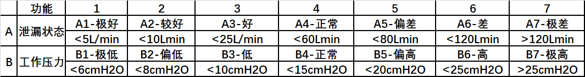

<<<<<<< HEAD
[TOC]

2019/8/13:
==========

1 减小blower在压力偏差大时调整的幅度
------------------------------------

2 增加peep-valve-control-data 和 blower-speed 的计算函数（由新的校准数据导出）
------------------------------------------------------------------------------

---

2019/8/16:
==========

1 recoding the method of PEEP-valve control data & speed control data
---------------------------------------------------------------------

---

```
void get_cpap_speed_and_peep_valve_control_data(uint16_t press, int32_t flow)
{
    int32_t speed,peep;
    double speed_add; d
    ouble speed_tmp; double peep_tmp; /
    // 初步设想取5-10cmH2O和10L/min的数据，后面每增加一个厘米水PEEP增加30，speed增加800

    speed_add = (double)press * 53.57 + 3197;
    speed_tmp = flow * 0.8 + speed_add;
    speed = (uint16_t) speed_tmp;

    peep_tmp = 0.03 * flow + 1133 - 2 * press;
    peep = (uint16_t) peep_tmp;
    ...
}
```

2019/08/19
==========

1 增加呼气阀流量平均值，用于后期呼气阀的状态调整
------------------------------------------------

### 测试发现如下问题：

### b1 从高到低的泄漏变化时，系统相应太慢

### b2 需要引入负的流量补偿以避免传感器漂移时出现奇怪的现象

### b3 Ti/Total的计算值在CPAP中有点不准

### b4 触发比率似乎在CPAP中没有用

2019/08/20
==========

1 引入无呼吸检测时间计数，用于未来的报警！
------------------------------------------

2019/8/21
=========

在测试CPAP过程中发现泄漏的算法还存在缺陷，主要体现在：
------------------------------------------------------

1.泄漏在变化时，无法及时的反映到控制中
--------------------------------------

2.当出现大的泄漏变化后，通气的触发也变得更困难----有待解决
----------------------------------------------------------

3.高呼吸频率时，Ti/Ttotal的计算也有些问题，似乎应该考虑触发算法本身的耗时
-------------------------------------------------------------------------

#### <font color=#22877b>添加系统工作状态，用于后期的控制</font>



#### 其中泄漏部分内容在之后的时间里进行测试， 压力部分需要在更晚些时候才能安排测试内容

###### 泄漏水平的定义

```c++
    typedef enum
    {
        EM_BREATH_LEAK_PERFACT, // 泄漏 <5 L/min
        EM_BREATH_LEAK_BETTER,  // 泄漏 <10 L/min    
        EM_BREATH_LEAK_GOOD,    // 泄漏 <25 L/min
        EM_BREATH_LEAK_NORMAL,  // 泄漏 <60 L/min
        EM_BREATH_LEAK_BAD,     // 泄漏 <80 L/min
        EM_BREATH_LEAK_WORSE,   // 泄漏 <120 L/min
        EM_BREATH_LEAK_WORST,   // 泄漏 >120 L/min
        EM_BREATH_LEAK_PIP_OUT  //
    } ENUM_BREATH_LEAK_LEVEL_TYPES;
    extern uint8_t system_breath_press_level;
```

###### 压力水平的定义

```c++
    typedef enum
    {
    	EM_BREATH_PRESS_LEVEL_LOWEST, // B1-极低 <6cmH2O
    	EM_BREATH_PRESS_LEVEL_LOWER,  // B2-偏低 <8cmH2O
    	EM_BREATH_PRESS_LEVEL_LOW,	  // B3-低   <10cmH2O
    	EM_BREATH_PRESS_LEVEL_NORMAL, // B4-正常 <15cmH2O
    	EM_BREATH_PRESS_LEVEL_HIGH,   // B5-偏高 <20cmH2O
    	EM_BREATH_PRESS_LEVEL_HIGHER, // B6-高  <25cmH2O
    	EM_BREATH_PRESS_LEVEL_HIGHEST // B7-极高 >25cmH2O
    } EM_PRESS_LEVEL_STATUS_TYPES;
=======
# 2019/8/13: 

## 1 减小blower在压力偏差大时调整的幅度 
## 2 增加peep-valve-control-data 和 blower-speed 的计算函数（由新的校准数据导出） 
----
# 2019/8/16: 

## 1 recoding the method of PEEP-valve control data & speed control data 
----
>>>>>>> 09277060316b0f50cfa53e2b258ee5e36810174d
```
void get_cpap_speed_and_peep_valve_control_data(uint16_t press, int32_t flow)
{ 
  int32_t speed,peep;  
  double speed_add; 
  double speed_tmp; 
  double peep_tmp; 
  // 初步设想取5-10cmH2O和10L/min的数据，后面每增加一个厘米水PEEP增加30，speed增加800

  speed_add = (double)press * 53.57 + 3197;
  speed_tmp = flow * 0.8 + speed_add;
  speed = (uint16_t) speed_tmp;

<<<<<<< HEAD
###### 计算泄漏水平

```c++
void set_system_breath_leak_level(int32_t leak)
{
    if(leak < 5000)
        system_breath_leak_level = EM_BREATH_LEAK_PERFACT; // 泄漏 <5 L/min
    else if(leak < 10000)
        system_breath_leak_level = EM_BREATH_LEAK_BETTER;  // 泄漏 <10 L/min
    else if(leak < 25000)
        system_breath_leak_level = EM_BREATH_LEAK_GOOD;    // 泄漏 <25 L/min
    else if(leak < 60000)
        system_breath_leak_level = EM_BREATH_LEAK_NORMAL;  // 泄漏 <60 L/min
    else if(leak < 80000)
        system_breath_leak_level = EM_BREATH_LEAK_BAD;     // 泄漏 <80 L/min
    else if(leak < 120000)
        system_breath_leak_level = EM_BREATH_LEAK_WORSE;   // 泄漏 <120 L/min
    else
        system_breath_leak_level = EM_BREATH_LEAK_WORST;   // 泄漏 >120 L/min
}
```

###### 计算压力水平

```c++
void set_system_breath_press_level(int16_t press)
{
	if(press <= 60)
		system_breath_press_level = EM_BREATH_PRESS_LEVEL_LOWEST; // B1-极低 <6cmH2O
	else if(press <= 80)
		system_breath_press_level = EM_BREATH_PRESS_LEVEL_LOWER;  // B2-偏低 <8cmH2O
	else if(press <= 100)
		system_breath_press_level = EM_BREATH_PRESS_LEVEL_LOW;	  // B3-低   <10cmH2O
	else if(press <= 150)
		system_breath_press_level = EM_BREATH_PRESS_LEVEL_NORMAL; // B4-正常 <15cmH2O
	else if(press <= 200)
		system_breath_press_level = EM_BREATH_PRESS_LEVEL_HIGH;   // B5-偏高 <20cmH2O
	else if(press <= 250)
		system_breath_press_level = EM_BREATH_PRESS_LEVEL_HIGHER; // B6-高   <25cmH2O
	else
		system_breath_press_level = EM_BREATH_PRESS_LEVEL_HIGHEST; // B7-极高 >25cmH2O
}
```

2019/08/22
==========

准备测试程序，用于测试泄漏对触发和潮气量等显示参数的计算所带来的影响

测试上面的内容 A1-B1,A1-B2,A1-B3,A1-B4,A1-B5, A2-B1,A2-B2,A2-B3,A2-B4,A2-B5

```
	1. 开始的几个周期呼吸频率不太对
	2. 数据采集工具有丢包（很多的包 >80%）无法看到触发信号
	3. 当流量过大时，转速调整的速度可以考虑加快--这样效果更好
 	4. 压力控制有点偏低（大约0.8cmH2O)
 	5. 压力变化不足以判断触发状态，推测口端的压力变化可能更明显些--- 后期考虑做个测试，看看有多大变化
 	6. 由5推测目前的口端压力算法可能不尽完善，有待改进，等后期测试后再看。
```
=======
  peep_tmp = 0.03 * flow + 1133 - 2 * press;
  peep = (uint16_t) peep_tmp;
  ...
}
```
>>>>>>> 09277060316b0f50cfa53e2b258ee5e36810174d
